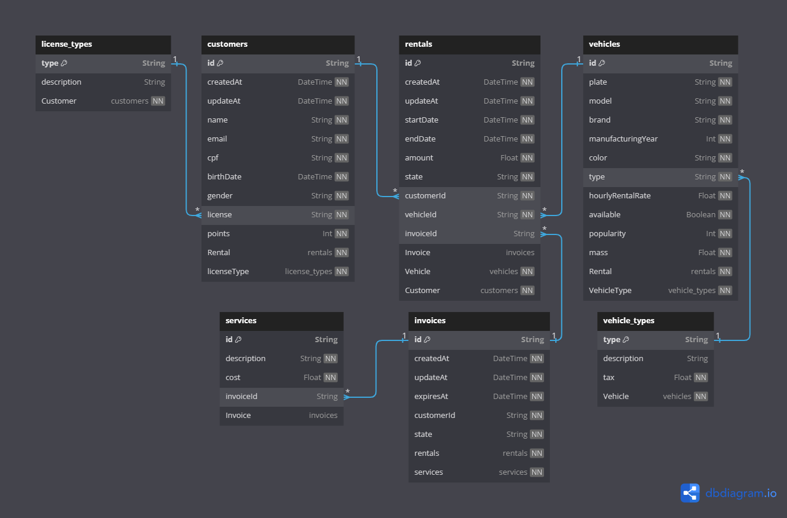

# iFood rentcars Project

## Descrição:

Bem-vindo ao repositório do projeto rentcars Project desenvolvido como parte do bootcamp do iFood!
Este é um aplicativo simples de aluguel de carros desenvolvido em equipe durante o bootcamp do iFood.
Desenvolvido com paixão e aprendizado ao longo do bootcamp, o Rentcars Project.

## Recursos Destacados:

- [x] Cadastrar veículo
- [x] Alugar veículo
- [x] Devolver veículo
- [x] Listar veículos disponíveis
- [x] Listar veículos alugados
- [x] Mostrar fatura do cliente
- [ ] ~~Sair do sistema~~

## Tecnologias Utilizadas:

- Node
- Typescript
- Vitest
- Tsup
- Eslint
- Prisma
- PostgreSQL

## Relacionamento das Entidades

## Equipe

- [dyda91](https://github.com/dyda91)
- [RudsonSantana](https://github.com/RudsonSantana)
- [corujaglaukopis](https://github.com/corujaglaukopis)
- [DavidWesley](https://github.com/DavidWesley)

## 📝 Licença

Este projeto está sob a licença [GPL-3.0](./LICENSE).
